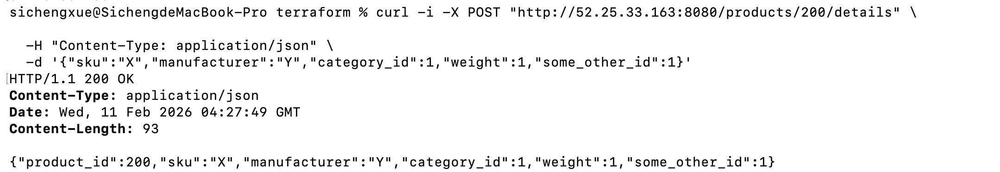
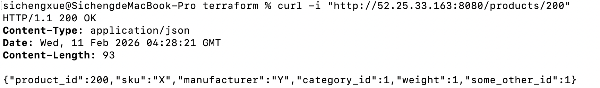
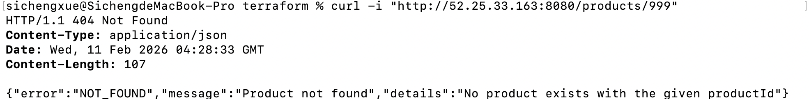
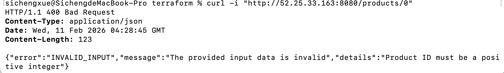
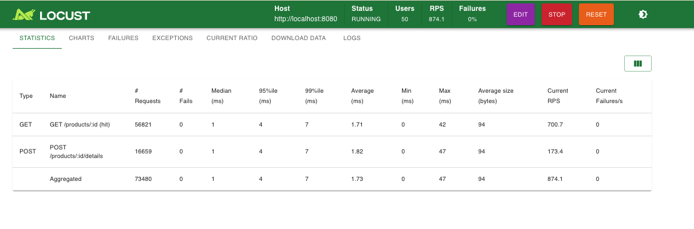
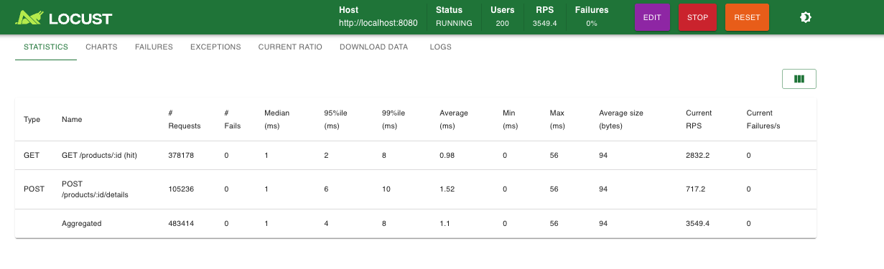

## Repo Structure

- `src/`
  - `main.go` (Product API server)
  - `go.mod`
  - `Dockerfile`
  - `.dockerignore`
- `terraform/`
  - `main.tf`, `variables.tf`, `output.tf`
  - `modules/` (ecr / ecs / network / logging)

---

## Prerequisites

- AWS CLI installed
- Terraform installed
- Docker installed & running
- AWS Learner Lab temporary credentials (Access key / Secret / Session token)

> Note (Apple Silicon / M1/M2/M3):  
> Terraform Docker build is configured with `platform = "linux/amd64"`.  
> Without this, ECS may fail with `exec /app/server: exec format error`.

---

## Prepare AWS Credentials

Retrieve temporary credentials from Learner Lab, then configure AWS:

Option A (AWS CLI config):

aws configure
aws configure set aws_session_token <YOUR_SESSION_TOKEN>

Option B (Environment variables):

export AWS_ACCESS_KEY_ID="..."

export AWS_SECRET_ACCESS_KEY="..."

export AWS_SESSION_TOKEN="..."

export AWS_DEFAULT_REGION="us-west-2"

Verify:
aws sts get-caller-identity

## Deploy Infrastructure

cd terraform
terraform init
terraform apply

## Get Public IP (ECS Task)

Run in terraform/ folder:

aws ec2 describe-network-interfaces \
 --region us-west-2 \
 --network-interface-ids $(
aws ecs describe-tasks \
 --region us-west-2 \
 --cluster $(terraform output -raw ecs_cluster_name) \
 --tasks $(
aws ecs list-tasks \
 --region us-west-2 \
 --cluster $(terraform output -raw ecs_cluster_name) \
 --service-name $(terraform output -raw ecs_service_name) \
 --desired-status RUNNING \
 --query 'taskArns[0]' --output text
) \
 --query "tasks[0].attachments[0].details[?name=='networkInterfaceId'].value" \
 --output text
) \
 --query 'NetworkInterfaces[0].Association.PublicIp' \
 --output text

## Set:

export PUBLIC_IP="<the-output-ip>"

Base URL:
http://$PUBLIC_IP:8080

## API Examples (showing required response codes)

200 OK (Create)
curl -i -X POST "http://$PUBLIC_IP:8080/products/200/details" \
 -H "Content-Type: application/json" \
 -d '{"sku":"X","manufacturer":"Y","category_id":1,"weight":1,"some_other_id":1}'

200 OK (Get existing)
curl -i "http://$PUBLIC_IP:8080/products/200"

404 Not Found (Get missing)
curl -i "http://$PUBLIC_IP:8080/products/999"

400 Bad Request (Invalid productId)
curl -i "http://$PUBLIC_IP:8080/products/0"

## Clean Up

cd terraform
terraform destroy

.gitignore Notes

## Do NOT commit:

terraform.tfstate\*

.terraform/

\*.tfvars

secrets, keys, .env

## Load Testing with Locust

We used Locust to evaluate the performance and scalability of the Product API.

### Test Setup

- Environment: Local machine
- Tool: Locust
- Workload distribution:
  - ~80% GET /products/{id}
  - ~20% POST /products/{id}/details
- Backend storage: in-memory hash map

### Results (50 Users)

- Throughput: ~870 requests/sec
- Failure rate: 0%
- p95 latency: < 5 ms

### Stress Test (200 Users)

- Throughput: ~3560 requests/sec
- Failure rate: 0%
- p95 latency:
  - GET: ~2 ms
  - POST: ~7 ms
- The system remained stable under higher concurrency.

### Discussion

In a real-world e-commerce scenario, read operations (GET product) are far more common than write operations (POST product). Using an in-memory hash map allows O(1) access for reads, which significantly benefits read-heavy workloads.

I observed little difference between HttpUser and FastHttpUser in Locust. This is likely because the performance bottleneck lies in the Go server and local CPU scheduling rather than the Python HTTP client. Since each request performs lightweight in-memory operations, client-side overhead has minimal impact on overall latency.
